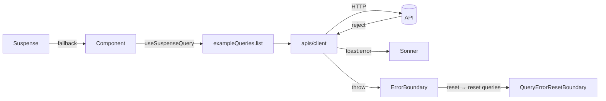

<div align="center">

# react-vite-starter

**프로젝트마다 손이 가는 스택을 모아둔 개인용 React 19 + Vite 스타터.**

[English](./README.md) · [한국어](./README.ko.md)

[](https://react.dev)
[](https://vite.dev)
[](https://www.typescriptlang.org)
[](https://tailwindcss.com)
[](https://tanstack.com/query)
[](https://reactrouter.com)
[](https://ui.shadcn.com)
[](https://yarnpkg.com)

</div>

---

## ✨ 특징

| | |
| --- | --- |
| ⚛️ **React 19 + Vite 8** | TypeScript, `@/*` 경로 별칭, `vite-plugin-svgr`로 SVG → 컴포넌트 |
| 🎨 **Tailwind v4 + shadcn/ui** | Radix Nova 프리셋, Lucide 아이콘, Pretendard Variable 폰트 |
| 🧭 **React Router v7** | 선언형(declarative) 모드 (`BrowserRouter` + `Routes` + `Route`) |
| 🔄 **TanStack Query 5** | `@suspensive/react` + `@suspensive/react-query` 기반 Suspense 우선 패턴 |
| 🛡️ **에러 바운더리** | 라우터에 `QueryErrorResetBoundary` ↔ Suspensive `ErrorBoundary` 연결 |
| 📡 **Axios 클라이언트** | 응답 에러 → `toast.error`, 프로덕션 환경변수 가드, 인증 헤더 시드 포함 |
| 📋 **React Hook Form + Zod** | `zodResolver`, 페이지별 스키마, 뮤테이션으로 제출 |
| 🐻 **Zustand** | 커링된 `create` + `devtools` 미들웨어, slices 패턴 대응 |
| 🪟 **`overlay-kit`** | 명령형 `overlay.open(Async)` 다이얼로그 (Toss) |
| 🔔 **`sonner`** | 루트에 `<Toaster />` 마운트 완료 |
| 📐 **ESLint 10 + Prettier** | flat config, `prettier-plugin-tailwindcss`, shadcn 파일은 refresh 룰 예외 |
| 📦 **Yarn 4** | `nodeLinker: node-modules`, `engines.node ≥ 20`, `.nvmrc` 고정 |
| 🤖 **Agent-ready** | `AGENTS.md` + `.agent/workflows/*.md`로 AI 도구가 컨벤션을 일관되게 따르도록 구성 |

## 🚀 빠른 시작

```bash
git clone <repo> my-app
cd my-app
nvm use            # 또는 Node 20 이상
yarn
cp .env.example .env.local   # VITE_API_BASE_URL 설정
yarn dev
```

<http://localhost:5173>에서 확인하세요. 홈 페이지에 query, form + mutation, dialog 패턴이 모두 데모로 들어가 있습니다.

## 📜 스크립트

| 명령어 | 설명 |
| --- | --- |
| `yarn dev` | Vite 개발 서버 실행 |
| `yarn build` | 타입 체크(`tsc -b`) 후 프로덕션 빌드 |
| `yarn preview` | 프로덕션 빌드 미리보기 |
| `yarn lint` | ESLint 실행 |
| `yarn format` | `src/`에 Prettier + ESLint `--fix` 적용 |
| `yarn type-check` | `tsc --noEmit -p tsconfig.app.json` |

## 🌱 환경 변수

모든 클라이언트 환경 변수는 `VITE_` 접두사가 필요하며, gitignore된 `.env.local`에 정의합니다.

```env
VITE_API_BASE_URL=https://api.example.com
```

`src/apis/client.ts`는 **프로덕션 빌드**에서 `VITE_API_BASE_URL`이 비어 있으면 즉시 throw합니다. 개발 모드에서는 상대 경로 `baseURL`로 동작합니다.

## 🗂 폴더 구조

```
src/
├── apis/                   # axios 클라이언트 + 도메인별 query/mutation 팩토리
│   ├── client.ts           # axios 인스턴스 + 인터셉터 + 프로덕션 env 가드
│   └── example/            # 예시 도메인 — 이 구조를 그대로 따라가면 됩니다
│       ├── exampleApi.ts
│       ├── example.queries.ts
│       ├── example.mutations.ts
│       ├── example.types.ts
│       └── index.ts
├── components/
│   ├── RootLayout.tsx
│   ├── RootErrorFallback.tsx
│   └── ui/                 # shadcn 컴포넌트 위치
├── pages/
│   ├── HomePage/           # 페이지가 자체 components/hooks/schemas를 소유
│   │   ├── HomePage.tsx
│   │   ├── components/
│   │   └── schemas/
│   └── NotFoundPage.tsx
├── routes/Router.tsx       # BrowserRouter + Routes + Route + ErrorBoundary + Suspense
├── stores/                 # Zustand 스토어
├── hooks/                  # 여러 도메인이 공유하는 훅만
├── lib/utils.ts            # cn() 헬퍼
├── index.css               # @import "tailwindcss" + theme 토큰
└── main.tsx                # createRoot + Providers (Query, Overlay)
```

페이지 전용 훅/스키마는 `pages/<PageName>/{hooks,schemas,components}/` 아래에 두고, 여러 페이지가 공유하는 훅만 `src/hooks/`로 올립니다.

## 🔁 데이터 흐름



## 🧩 shadcn 컴포넌트 추가

기본 키트로 `button`, `input`, `label`, `form`, `card`, `dialog`가 미리 설치되어 있습니다. 필요한 컴포넌트는 그때그때 추가하세요:

```bash
npx shadcn@latest add <name>
```

컴포넌트는 `src/components/ui/`에 생성됩니다. `@/*` 별칭은 `tsconfig.json` + `tsconfig.app.json`, 그리고 Vite 내장 `resolve.tsconfigPaths`(`vite.config.ts`에서 활성화)를 통해 `src/*`로 해석됩니다.

## 📐 컨벤션

- **쿼리** — 기본은 `useSuspenseQuery` + `<Suspense>` + `<ErrorBoundary>` 조합. 조건부 페칭(`enabled`)이나 비-suspense 렌더링이 필요할 때만 `useQuery`를 사용합니다.
- **Query 팩토리** — `xxxQueries.{all, lists, list, detail}` 형태로 `queryOptions(...)`를 반환. 예: `src/apis/example/example.queries.ts`.
- **뮤테이션** — `apis/{domain}/{domain}.mutations.ts`에 위치하며, 변경 범위에 맞는 가장 좁은 키를 invalidate.
- **폼** — `useForm({ resolver: zodResolver(schema), mode: 'onBlur' })`, 스키마는 `pages/<Page>/schemas/`에 둡니다. 제출은 뮤테이션으로 위임.
- **다이얼로그** — `overlay.open(Async)`로 명령형으로 엽니다. 부모에서 open/close 상태를 `useState`로 들고 있지 마세요.
- **Zustand** — `devtools(..., { name: 'store-name' })`로 감싸 Redux DevTools에서 식별 가능하게.
- **경로 별칭** — `@/*` 하나만 사용. `baseUrl: src` 추가 금지 — 진실은 한 곳에.

## 🤖 AI 에이전트와 함께 작업하기

이 리포지토리에는 Claude Code, Cursor, Codex 같은 도구가 동일한 컨벤션을 따르도록 하는 에이전트 룰셋이 포함되어 있습니다:

- [`AGENTS.md`](./AGENTS.md) — 모든 에이전트가 처음 읽는 진입점.
- [`.agent/workflows/`](./.agent/workflows) — 도메인별 규칙:
  `behavior.md` · `commands.md` · `api.md` · `forms.md` · `components.md` · `shadcn.md` · `state.md` · `dialogs.md` · `folder.md`.

Claude Code용 `CLAUDE.md`는 `AGENTS.md`를 import만 하므로 단일 진실 공급원이 유지됩니다.

## 📄 라이선스

MIT — 자유롭게 사용하세요.
