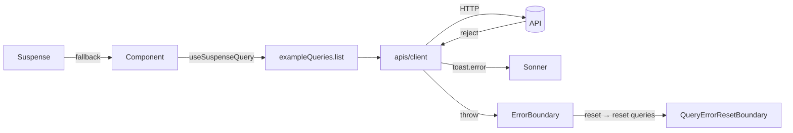

<div align="center">

# react-vite-starter

**Personal React 19 + Vite starter — the stack I reach for on every project.**

[English](./README.md) · [한국어](./README.ko.md)

[](https://react.dev)
[](https://vite.dev)
[](https://www.typescriptlang.org)
[](https://tailwindcss.com)
[](https://tanstack.com/query)
[](https://reactrouter.com)
[](https://ui.shadcn.com)
[](https://yarnpkg.com)

</div>

---

## ✨ Features

| | |
| --- | --- |
| ⚛️ **React 19 + Vite 8** | TypeScript, `@/*` path alias, SVG-as-component via `vite-plugin-svgr` |
| 🎨 **Tailwind v4 + shadcn/ui** | Radix Nova preset, Lucide icons, Pretendard variable font |
| 🧭 **React Router v7** | Declarative mode (`BrowserRouter` + `Routes` + `Route`) |
| 🔄 **TanStack Query 5** | Suspense-first via `@suspensive/react` + `@suspensive/react-query` |
| 🛡️ **Error boundaries** | `QueryErrorResetBoundary` ↔ Suspensive `ErrorBoundary` wired at the router |
| 📡 **Axios client** | Response error → `toast.error`, prod-required env check, auth-header seam |
| 📋 **React Hook Form + Zod** | `zodResolver`, page-local schemas, mutation-driven submit |
| 🐻 **Zustand** | Curried `create` + `devtools` middleware, slices-pattern ready |
| 🪟 **`overlay-kit`** | Imperative `overlay.open(Async)` for dialogs (Toss) |
| 🔔 **`sonner`** | Toaster mounted at the root |
| 📐 **ESLint 10 + Prettier** | Flat config, `prettier-plugin-tailwindcss`, shadcn/ui exempt from refresh rule |
| 📦 **Yarn 4** | `nodeLinker: node-modules`, `engines.node >= 20`, `.nvmrc` pinned |
| 🤖 **Agent-ready** | `AGENTS.md` + `.agent/workflows/*.md` so AI tools get the conventions right |

## 🚀 Quick start

```bash
git clone <repo> my-app
cd my-app
nvm use            # or: any Node ≥ 20
yarn
cp .env.example .env.local   # then set VITE_API_BASE_URL
yarn dev
```

Open <http://localhost:5173>. The home page demos the query, form-mutation, and dialog patterns.

## 📜 Scripts

| Command | What it does |
| --- | --- |
| `yarn dev` | Start the Vite dev server |
| `yarn build` | Type-check (`tsc -b`) and build for production |
| `yarn preview` | Preview the production build |
| `yarn lint` | Run ESLint |
| `yarn format` | Prettier + ESLint `--fix` over `src/` |
| `yarn type-check` | `tsc --noEmit -p tsconfig.app.json` |

## 🌱 Environment variables

All client env vars must be prefixed `VITE_`. Place them in `.env.local` (gitignored).

```env
VITE_API_BASE_URL=https://api.example.com
```

`src/apis/client.ts` throws if `VITE_API_BASE_URL` is missing in **production** builds. Dev builds fall back to a relative `baseURL`.

## 🗂 Folder layout

```
src/
├── apis/                   # axios client + per-domain query/mutation factories
│   ├── client.ts           # base axios + interceptors + prod env guard
│   └── example/            # example domain — mirror this shape
│       ├── exampleApi.ts
│       ├── example.queries.ts
│       ├── example.mutations.ts
│       ├── example.types.ts
│       └── index.ts
├── components/
│   ├── RootLayout.tsx
│   ├── RootErrorFallback.tsx
│   └── ui/                 # shadcn-generated components
├── pages/
│   ├── HomePage/           # each page owns its own components, hooks, schemas
│   │   ├── HomePage.tsx
│   │   ├── components/
│   │   └── schemas/
│   └── NotFoundPage.tsx
├── routes/Router.tsx       # BrowserRouter + Routes + Route + ErrorBoundary + Suspense
├── stores/                 # Zustand stores
├── hooks/                  # cross-cutting hooks only
├── lib/utils.ts            # cn() helper
├── index.css               # @import "tailwindcss" + theme tokens
└── main.tsx                # createRoot + Providers (Query, Overlay)
```

Page-owned hooks/schemas live under `pages/<PageName>/{hooks,schemas,components}/` — keep cross-cutting hooks in `src/hooks/`.

## 🔁 Data flow at a glance



## 🧩 Adding shadcn components

The starter pre-installs a common kit: `button`, `input`, `label`, `form`, `card`, `dialog`. Pull anything else on demand:

```bash
npx shadcn@latest add <name>
```

Components land in `src/components/ui/`. The `@/*` alias resolves to `src/*` via `tsconfig.json` + `tsconfig.app.json` and Vite's built-in `resolve.tsconfigPaths` (configured in `vite.config.ts`).

## 📐 Conventions

- **Queries** — Use `useSuspenseQuery` + `<Suspense>` + `<ErrorBoundary>` by default. Reach for `useQuery` only when you need `enabled` or non-suspending render.
- **Query factories** — `xxxQueries.{all, lists, list, detail}` returning `queryOptions(...)`. See `src/apis/example/example.queries.ts`.
- **Mutations** — Live in `apis/{domain}/{domain}.mutations.ts` and invalidate the narrowest matching key.
- **Forms** — `useForm({ resolver: zodResolver(schema), mode: 'onBlur' })` with the schema next to the page (`pages/<Page>/schemas/`). Submit delegates to a mutation.
- **Dialogs** — Open imperatively with `overlay.open(Async)`. Don't hold open/close state in `useState`.
- **Zustand stores** — Wrapped in `devtools(..., { name: 'store-name' })` so they show up in Redux DevTools.
- **Path alias** — `@/*` is the only resolution path. Don't add `baseUrl: src` — one path, one truth.

## 🤖 Working with AI agents

This repo ships with a complete agent ruleset so Claude Code, Cursor, Codex, and similar tools follow the same conventions:

- [`AGENTS.md`](./AGENTS.md) — entrypoint every agent reads first.
- [`.agent/workflows/`](./.agent/workflows) — per-domain rules:
  `behavior.md` · `commands.md` · `api.md` · `forms.md` · `components.md` · `shadcn.md` · `state.md` · `dialogs.md` · `folder.md`.

Claude Code's `CLAUDE.md` simply imports `AGENTS.md` so there's one source of truth.

## 📄 License

MIT — do whatever you want.
